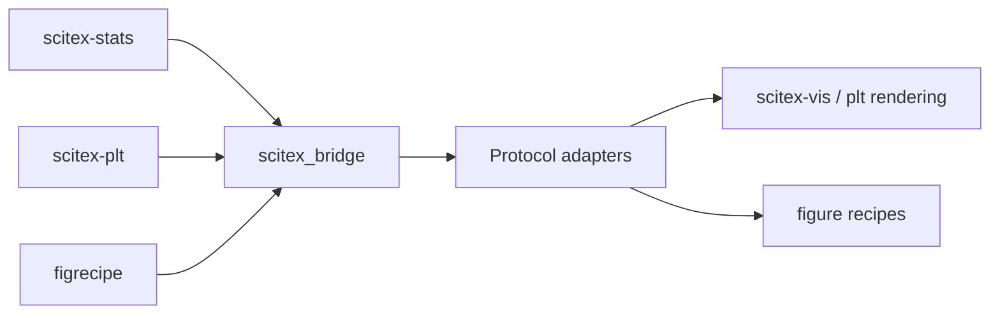

# scitex-bridge

<p align="center">
  <a href="https://scitex.ai">
    
  </a>
</p>

<p align="center"><b>Cross-module adapters between scitex.stats / matplotlib / vis-FigureModel.</b></p>

<p align="center">
  <a href="https://scitex-bridge.readthedocs.io/">Full Documentation</a> · <code>uv pip install scitex-bridge[all]</code>
</p>

<!-- scitex-badges:start -->
<p align="center">
  <a href="https://pypi.org/project/scitex-bridge/"></a>
  <a href="https://pypi.org/project/scitex-bridge/"></a>
  <a href="https://github.com/ywatanabe1989/scitex-bridge/actions/workflows/test.yml"></a>
  <a href="https://codecov.io/gh/ywatanabe1989/scitex-bridge"></a>
  <a href="https://scitex-bridge.readthedocs.io/en/latest/"></a>
  <a href="https://www.gnu.org/licenses/agpl-3.0"></a>
</p>
<!-- scitex-badges:end -->

---

## Installation

```bash
pip install scitex-bridge
```

## Architecture

```
src/scitex_bridge/
├── _protocol.py    # cross-package adapter Protocols
├── _figrecipe.py   # bridge into figrecipe (figure recipes)
├── _plt_vis.py     # plt -> visualization handoff
├── _stats_plt.py   # stats -> plt handoff
├── _stats_vis.py   # stats -> vis handoff
├── _helpers.py     # shared adapter helpers
├── _compat.py      # version/back-compat shims
└── _skills/        # SciTeX skills metadata
```

## Demo



## Quick Start

```python
import scitex_bridge as br
```

## 1 Interfaces

<details open>
<summary><strong>Python API</strong></summary>

<br>

```python
import scitex_bridge as br

# Add stats results to either backend (auto-detects)
br.add_stats_from_results(target, stat_results, format_style="asterisk")

# Stats → matplotlib annotation
br.add_stat_to_axes(ax, stat_result)
br.format_stat_for_plot(stat_result, style="asterisk")
br.extract_stats_from_axes(ax)

# Stats → vis (FigureModel)
br.stat_result_to_annotation(stat_result)
br.add_stats_to_figure_model(fig_model, stat_results)
br.position_stat_annotation(fig_model, stat_result, prefer_corner="top-right")

# plt ↔ vis
br.matplotlib_to_figure_model(fig)
br.figure_model_to_matplotlib(fig_model)

# Protocols (Position duck-typing target)
from scitex_bridge import Position
```

</details>

## Status

Standalone fork of `scitex.bridge`. Deps: matplotlib + scipy.

Decoupling notes:
- `scitex.io.bundle.kinds._stats.Position` → vendored as a tiny dataclass in
  `_compat.py`. When `scitex` (umbrella) is installed, the real Position is
  preferred so produced objects round-trip cleanly through bundle code paths.
- The optional `scitex.io.bundle.kinds._plot._models` imports remain inside
  `try/except ImportError` so the package works fully standalone.

The umbrella package's `scitex.bridge` import path is preserved via a
`sys.modules`-alias bridge.

## Part of SciTeX

`scitex-bridge` is part of [**SciTeX**](https://scitex.ai). Install via
the umbrella with `pip install scitex[bridge]` to use as
`scitex.bridge` (Python) or `scitex bridge ...` (CLI).

>Four Freedoms for Research
>
>0. The freedom to **run** your research anywhere — your machine, your terms.
>1. The freedom to **study** how every step works — from raw data to final manuscript.
>2. The freedom to **redistribute** your workflows, not just your papers.
>3. The freedom to **modify** any module and share improvements with the community.
>
>AGPL-3.0 — because we believe research infrastructure deserves the same freedoms as the software it runs on.

## License

AGPL-3.0-only (see [LICENSE](./LICENSE)).

---

<p align="center">
  <a href="https://scitex.ai" target="_blank"></a>
</p>

